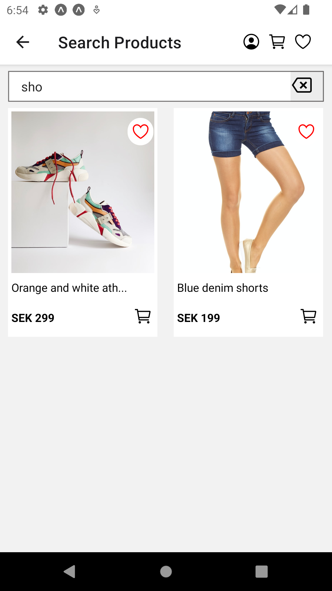
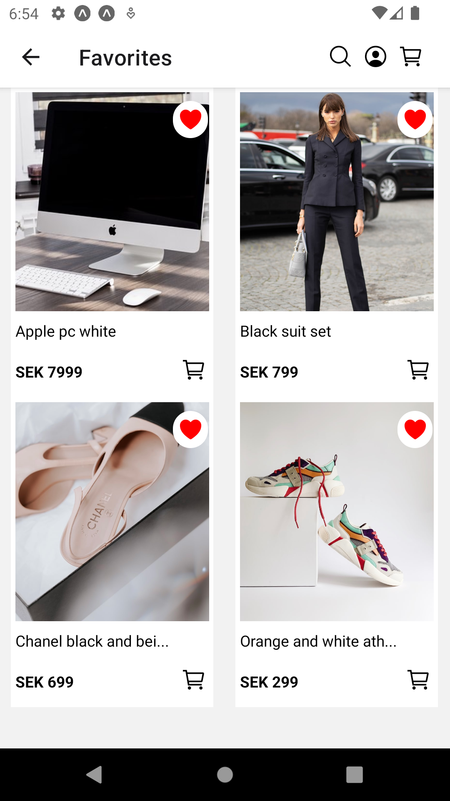
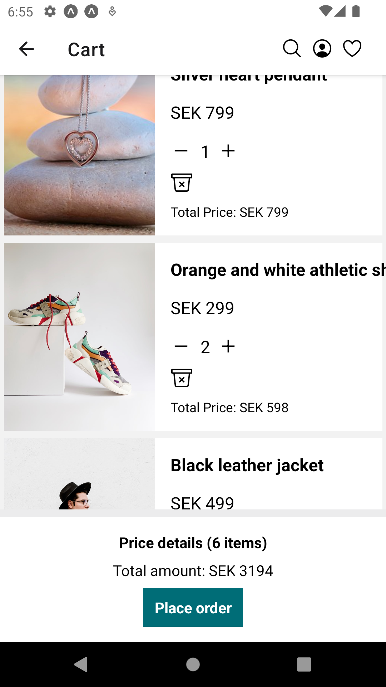

# Shopzone App

## Description

A React Native + TypeScript Shopzone app (for the hobby project Shopzone e-coomerce website) built using Expo. The app allows users to authenticate themselves and explore products.

## Features

- Login/sign up and sign out
- View products by category
- View all products
- Toggle Favorites
- Add products to cart, remove products from cart, increase/decrease the quantity of products in the cart.

## Screenshots

  
  
  
    
    

## Prerequisites

- Node.js and npm should be installed on your machine.
- Expo CLI should be installed globally.
- Android emulator or a physical Android device for testing.

## Installation

1. Clone the repository or download the source code.
2. Open a terminal and navigate to the project directory.
3. Run npm install to install the required dependencies.
4. Run expo start to start the Expo development server.
5. Use an Android emulator or scan the QR code with the Expo app on your physical Android device to launch the app.

## Usage

- Upon launching the app, you will see the expense list screen.
- Tap on the category to view the products in that category.
- Tap on the Product card to view details about the product.
- Tap on the "heart" icon on the Product card to toggle the product in Favorites (if authenticated).
- Tap on the "cart" icon, to add product to the cart.
- To see the list of products in Favorites, tap on the "heart" icon in header.
- To see the products in the Cart, tap on the "cart" icon in the header.
- To search for products, tap on the "search" icon in the header.
- To login/sign up, tap on the "avatar" icon in the header. If the user is already signed in, tapping on it enables users to sign out.

## Data Storage

The app utilizes Expo SecureStore to store token locally on the device. This allows for persistent storage of token even when the app is closed or restarted.

## Dependencies

- React Native: 0.71.8
- Expo: 48.0.18
- React Navigation: 6.0.2
- expo-secure-store: ~12.1.1
- axios: 1.4.0
- @reduxjs/toolkit": ^1.9.5
